## Задача 1

Дайте письменые ответы на следующие вопросы:

- В чём отличие режимов работы сервисов в Docker Swarm кластере: replication и global?
- Какой алгоритм выбора лидера используется в Docker Swarm кластере?
- Что такое Overlay Network?

## Ответ  
Global — это сервис, который запускает одну задачу на каждой ноде. Каждый раз, при добавлении нод в swarm, оркестратор создает задачу, а планировщик назначает задачу новой ноде. Примерами таких сервисов являются агенты мониторинга, антивирусные сканеры или другие типы контейнеров, которые должны работать на каждой ноде.  
Для replication сервиса мы указываем, сколько идентичных задач нужно запустить. Примером может являться веб сервис HTTP с тремя репликами, каждая из которых обслуживает один и тот же контент. При этом в отличии от глобала данный сервис не будет установлен на каждой ноде.  

В Docker Swarm кластере используется Raft (алгоритм поддержания распределенного консенсуса). При потери управляющей ноды, ноды-фолловеры переходят в режим кандидата на лидера и посылают остальным нодам запрос на голосование по результатом которого и выбирается лидер (демонстрация сего процесса http://thesecretlivesofdata.com/raft/).  

Overlay-сети используются в контексте кластеров (Docker Swarm), где виртуальная сеть, которую используют контейнеры, связывает несколько физических хостов, на которых запущен Docker.

## Задача 2

Создать ваш первый Docker Swarm кластер в Яндекс.Облаке

Для получения зачета, вам необходимо предоставить скриншот из терминала (консоли), с выводом команды:
```
docker node ls
```

## Задача 3

Создать ваш первый, готовый к боевой эксплуатации кластер мониторинга, состоящий из стека микросервисов.

Для получения зачета, вам необходимо предоставить скриншот из терминала (консоли), с выводом команды:
```
docker service ls
```

## Ответ  
Скрин консоли сделать забыл, но для себя параллельно пилил мануал в вики, поэтому предоставляю скрины сервиса в облаке + выводы команд из задания 2 и 3, но уже в OneNote:  
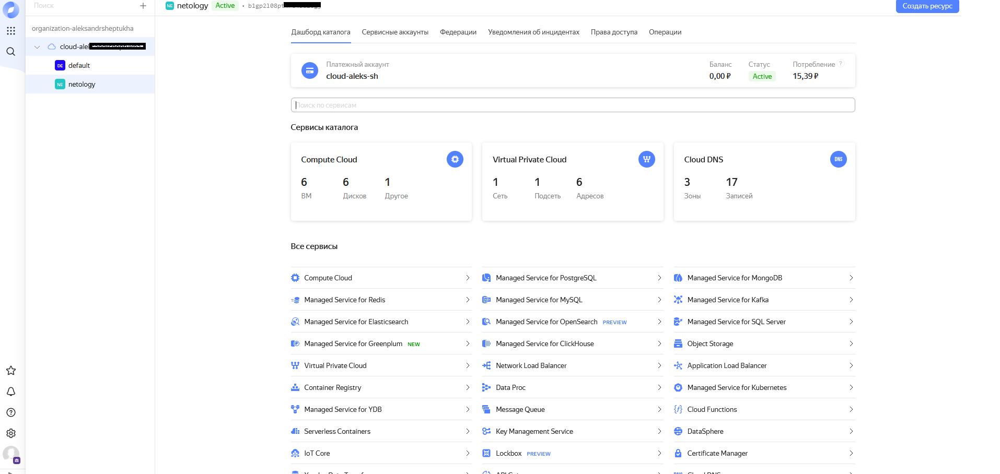
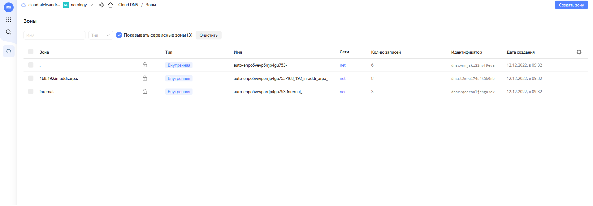
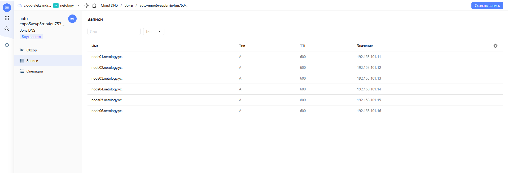
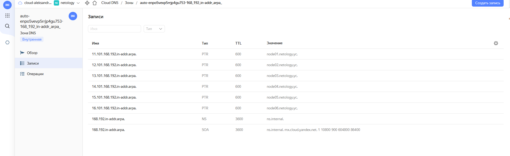
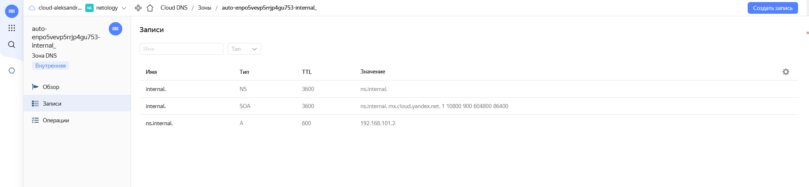
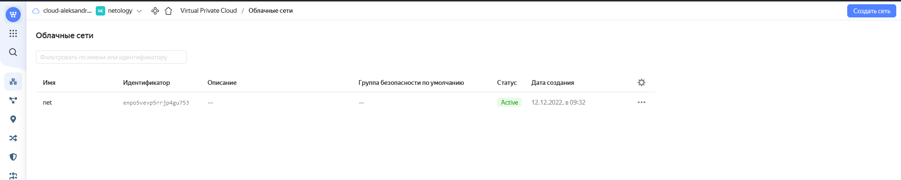
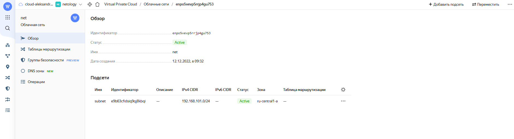
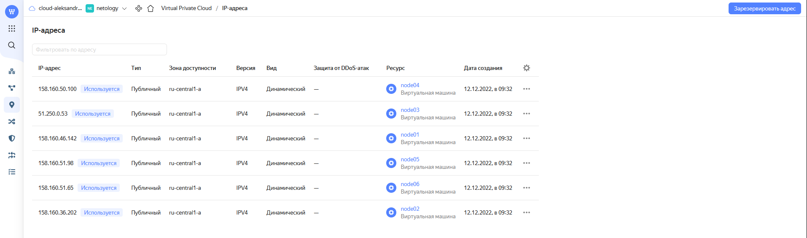
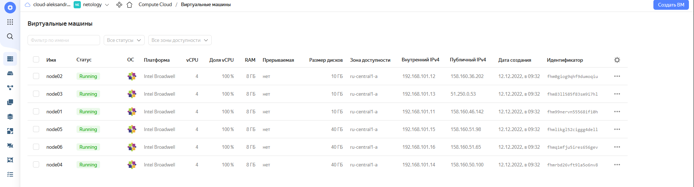
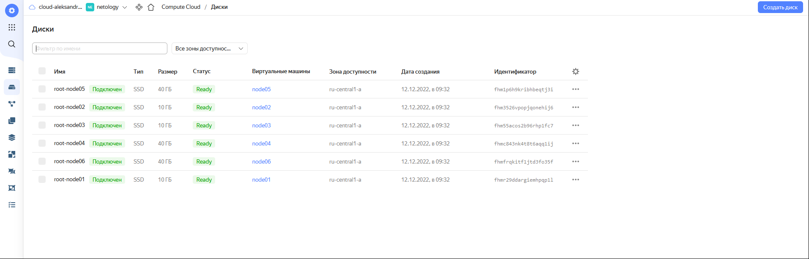
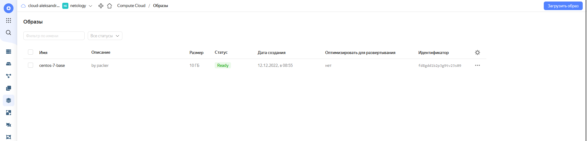
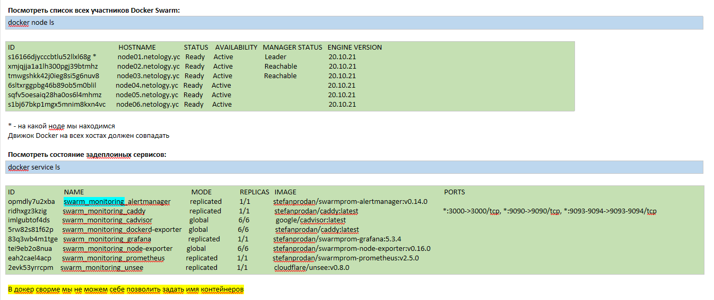
